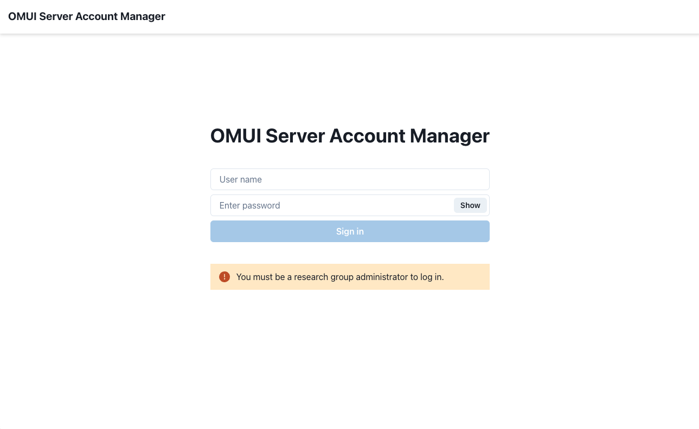
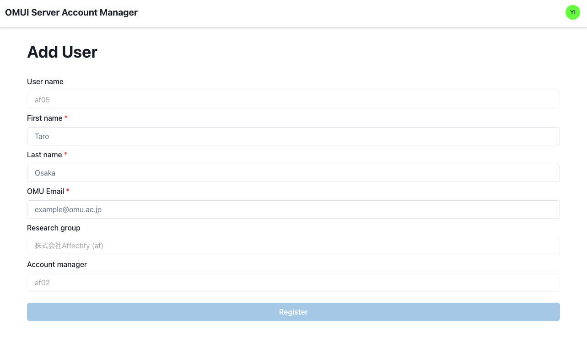
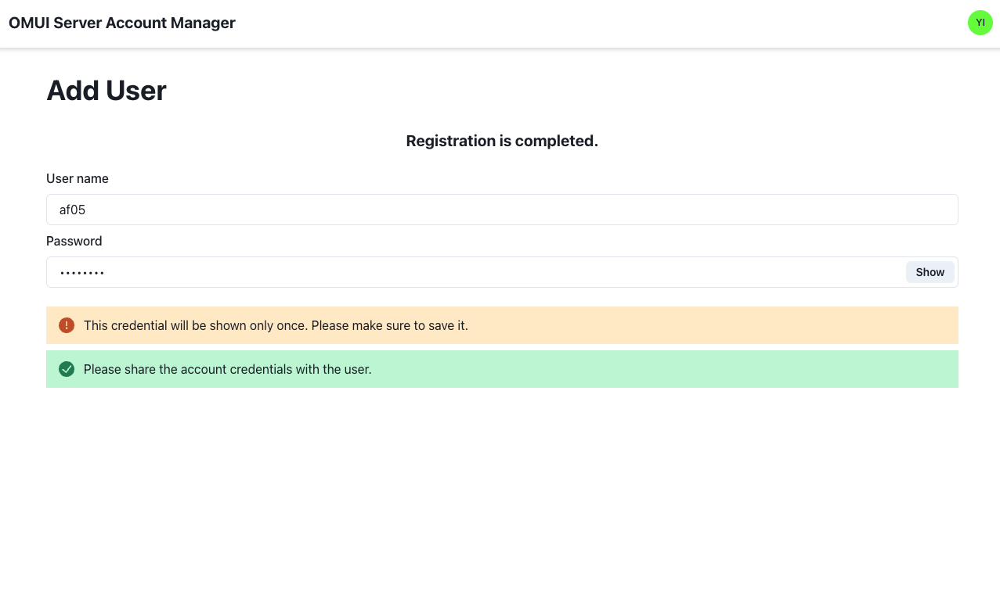
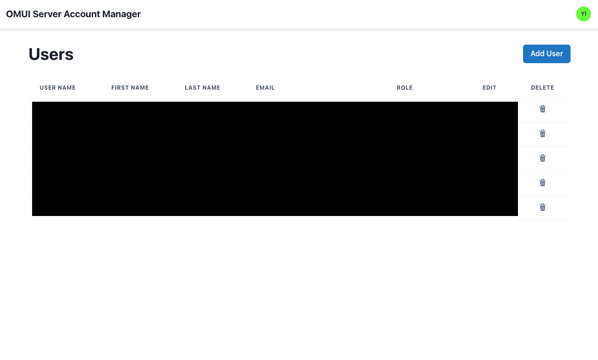

# Managing users

## OMUI Server Account Manager

OMUI Server provides a GUI tool called **OMUI Server Account Manager** for user management.

## Login to OMUI Server Account Manager

[Click here](http://172.26.59.40/accounts) to open OMUI Server Account Manager, and login with your OMUI Server credentials (the credentials used for SSH connection).


This tool is only accessible from the OMUNET.



You must be registered as a research group administrator on OMUI Server to log in.


## Adding users

Log in to OMUI Server Account Manager and click **Add User** in the upper right corner.
The account creation page will appear.

### User information

You will first be asked for personal information.

- **First name**
- **Last name**
- **OMU Email**: The user's university domain email address (`*.omu.ac.jp`, `*.osakafu-u.ac.jp`, `*.osaka-cu.ac.jp`)

### Password

After entering the user's personal information, click "Register" to display the user's authentication information.
Share this information with the user.
The authentication information will only be displayed once, so be sure to write it down.

## Edit users

Log in to OMUI Server Account Manager and click the edit button (pencil icon) for the user you wish to edit.

## Adding research group administrators

To make a specific user a research group administrator, open the user edit screen and change the Role to **Admin**.
Research group administrators will be able to use the `sudo` command on the server, so be careful with the settings.
