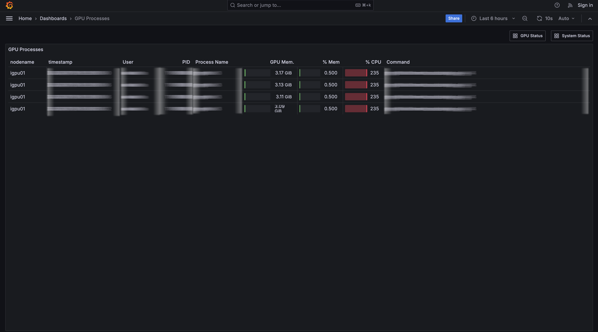
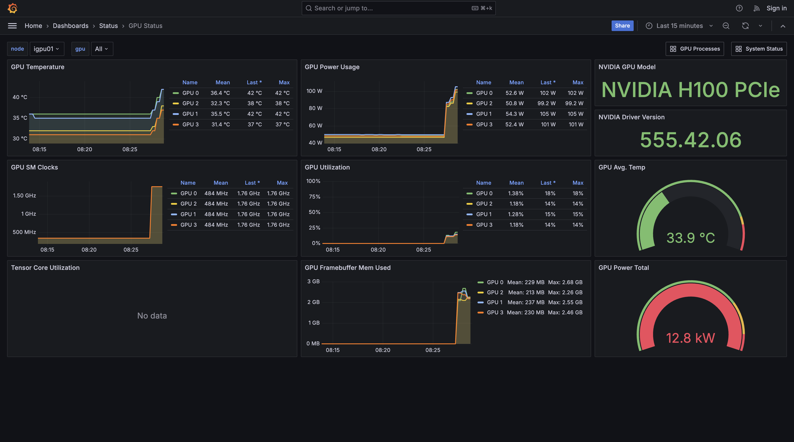

# GPU Monitoring

OMUI Server provides a job and server status monitoring tool using Grafana.

[Click here](http://172.26.43.2:3000/) to access the monitoring tool.

## GPU Processes

This is a landing page of the tool.
You can check the list of current GPU processes for each user.
The information includes GPU memory usage, main memory usage and CPU usage.

## GPU Status

Here you can see GPU utilization by GPU device.
Before using a GPU, make sure that no one else is using the GPU device you wish to use.

## System Status

This page visualizes system status other than GPUs, including CPU utilization, main memory utilization, storage, and network status.

