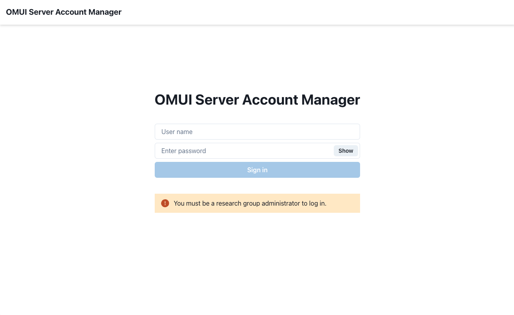
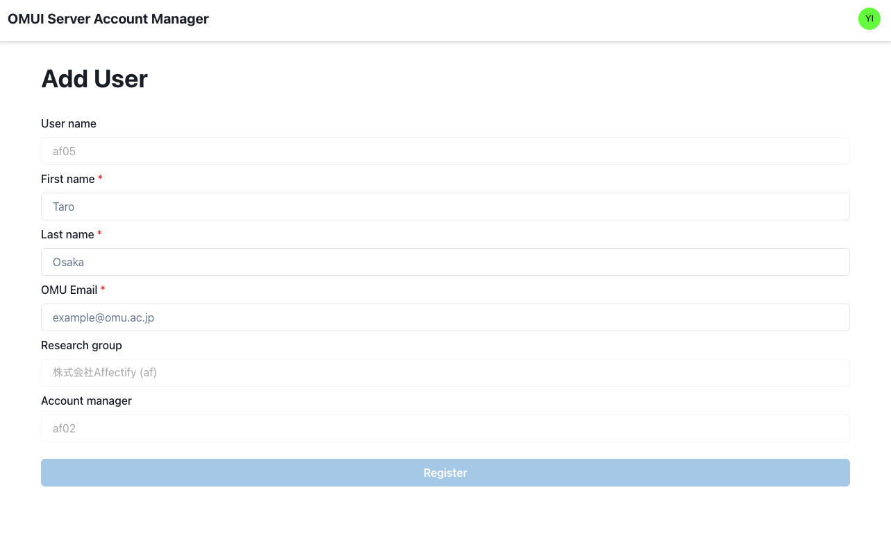
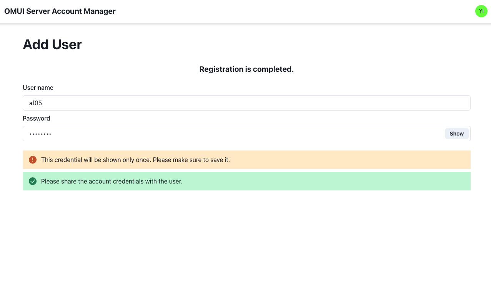
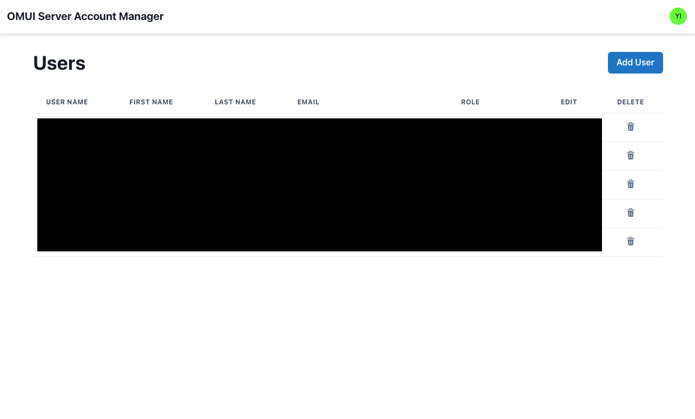
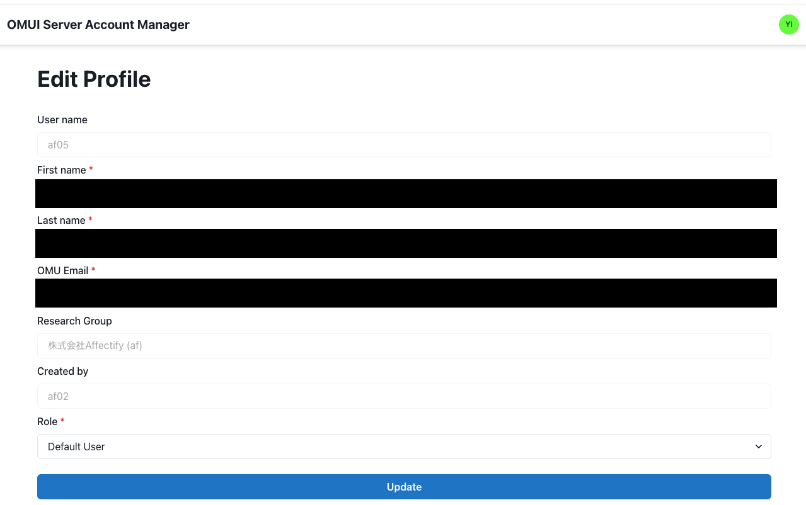

# ユーザ管理

## OMUI Server Account Manager

OMUI Serverでは、ユーザ管理を行うためのGUIツールとして **OMUI Server Account Manager** を提供しています。

## ログイン

[こちら](http://172.26.59.40/accounts) からOMUI Server Account Managerにアクセスし、OMUI Serverの認証情報 (SSH接続する際の認証情報) を使ってログインしてください。


ログインするには、OMUI Serverに研究グループ管理者として登録されている必要があります。


## ユーザの追加

OMUI Server Account Managerにログインし、右上の "Add User" をクリックしてください。
アカウント作成画面が表示されます。

### ユーザ情報

最初に個人情報を聞かれるので、以下の情報を入力してください。

- **First name**: ユーザの名
- **Last name**: ユーザの姓
- **OMU Email**: ユーザの大学ドメイン (`*.omu.ac.jp`, `*.osakafu-u.ac.jp`, `*.osaka-cu.ac.jp`) のメールアドレス

### パスワード

ユーザの個人情報の入力が完了し、Registerボタンを押すと、ユーザの認証情報が表示されます。
認証情報はアカウント作成者が本人に共有してください。
認証情報は一度しか表示されないので、メモしておいてください。

## ユーザの編集

OMUI Server Account Managerにログインし、編集したいユーザの編集ボタン (鉛筆のアイコン) をクリックします。

## 研究グループ管理者の追加

特定のユーザを研究グループ管理者にする場合は、ユーザ編集画面を開き、Roleを "Admin" に変更してください。
研究グループ管理者は、サーバ上で `sudo` コマンドを使用できるようになりますので、設定には注意してください。
