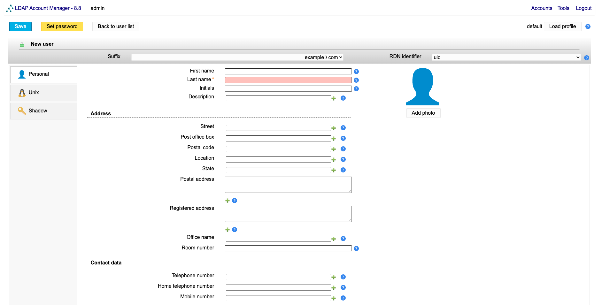
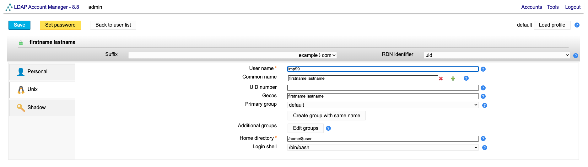
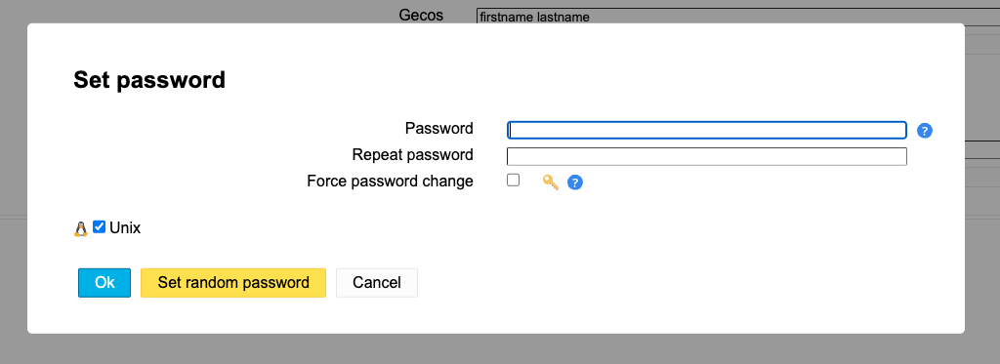
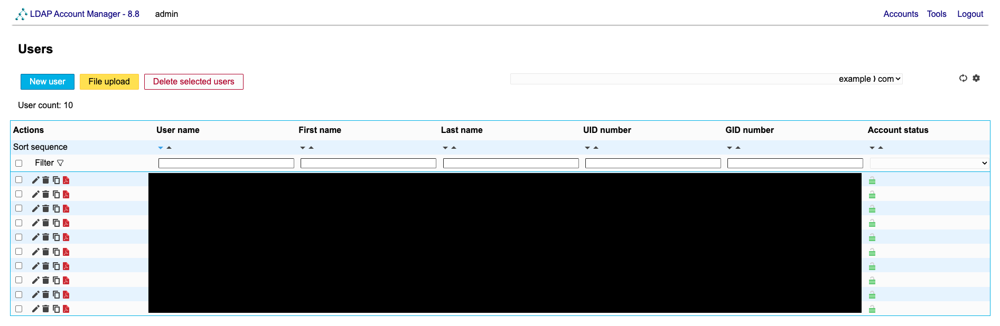

# ユーザ管理

## LDAP Account Manager (LAM)

OMUI ServerではLDAPを使ってユーザ管理を行っています。
しかし、LDAPをコマンドで操作するのは少し手間です。
そこで、[**LDAP Account Manager (LAM)**](https://www.ldap-account-manager.org) と呼ばれるGUIツールを使用してユーザ管理を行います。

## LAMのログイン

## ユーザの追加

### ユーザ情報の入力

LAMにログインし、左上の "New user" をクリックしてください。
ユーザ編集画面が表示されます。

最初に個人情報を聞かれるので、以下の情報を入力してください。
他の項目は空欄でOKです。

- **First name**: ユーザの名
- **Last name**: ユーザの姓
- **Contact data**
  - **Email address**: ユーザの大学のメールアドレス

左のタブから "Unix" を選択し、以下の情報を入力してください。
他の項目は空欄でOKです。

- **User name**: 希望するユーザ名
- **Primary group**: 研究グループIDを選択


ホームディレクトリはユーザが初回ログイン時に自動生成されます。
(所有者はユーザ、所有グループはユーザの)
そのため、管理者が手動で作成する必要はありません。


### パスワードの設定

左上の "Set password" を開き、 "Set random password" をクリックします。
初期パスワードが生成されるので、こちらをどこかにメモしておきます。
メモしたらOKを押します。

### 保存

以上が完了したら左上の "Save" をクリックします。
ユーザがLDAPに登録されます。

登録が完了したら、以下のログイン情報をユーザに連絡してください。


**ログイン情報**

- ユーザ名
- 初期パスワード


## ユーザの編集

LAMにログインし、編集したいユーザの編集ボタン (鉛筆のアイコン) をクリックします。
ユーザ編集画面が開きます。

必要な情報を編集し、最後に左上の "Save" をクリックしてください。

## 管理者権限の付与

特定のユーザに管理者権限を付与したい場合は、ユーザ編集画面のUnixタブを開き、"Additional groups" に以下のグループを追加してください。

- `omuiadmin`

このグループに所属するユーザは `sudo` コマンドを使用できるようになります。