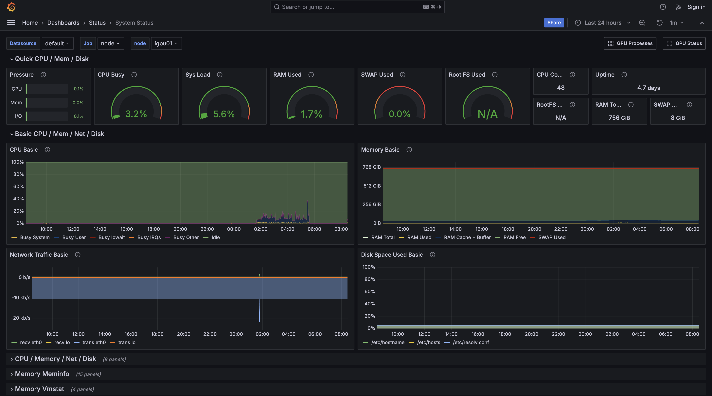

# GPU Monitoring

OMUI ServerではGrafanaを使った、ジョブおよびサーバーステータスのモニタリングツールを用意しています。

[こちら](http://172.26.59.40/) からモニタリングツールにアクセスしてください。

## GPU Processes

モニタリングツールを開くと最初に表示されます。
ここではGPUを使用している処理をユーザごとにGPUメモリ使用率、メインメモリ使用率、CPU使用率とともに表示します。

## GPU Status

ここではGPU使用率をGPUのデバイスごとに確認できます。
GPUを利用する前に、使用したいGPUデバイスを誰も使っていないことを確認してください。

## System Status

ここではCPU使用率、メインメモリ使用率、ストレージ、ネットワークの状態など、GPU以外のシステムの状態を可視化しています。

